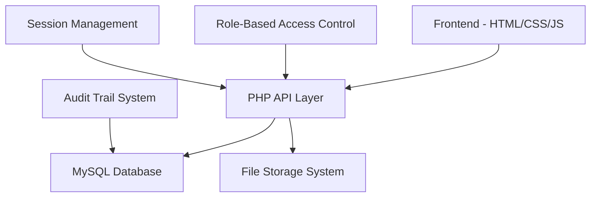
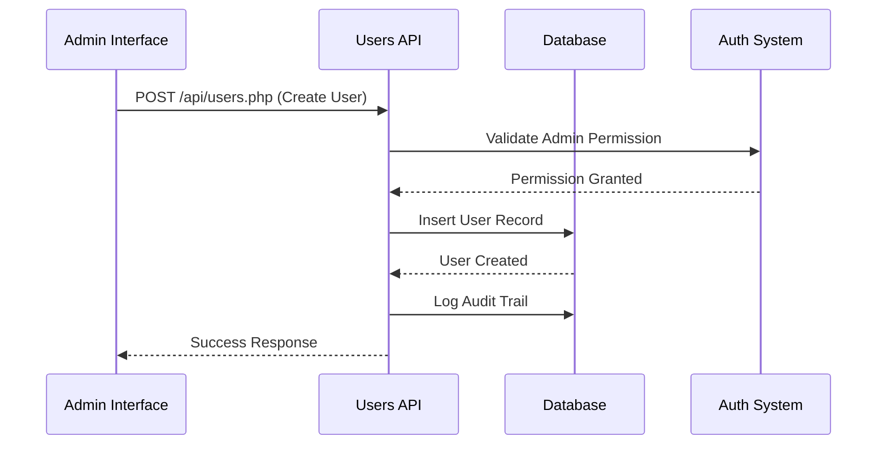
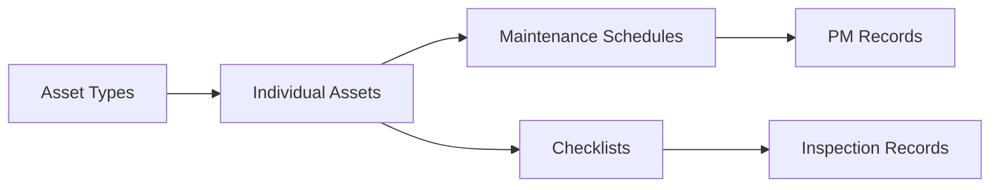
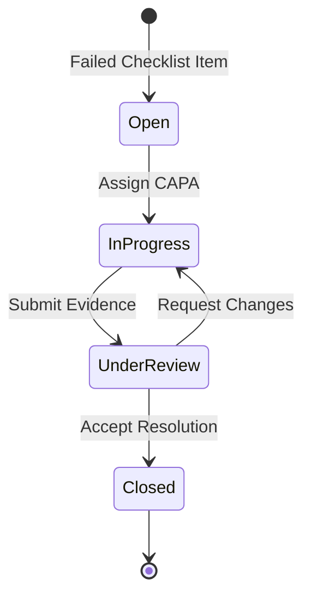

# QuailtyMed Missing Features Implementation Plan

## Overview

This document outlines the implementation plan for missing features and bug fixes in the QuailtyMed Healthcare Quality Management System. The analysis reveals several critical gaps between documented features and actual implementation.

## Architecture

The QuailtyMed system follows a **monolithic architecture** with clear separation of concerns:



### Current Technology Stack
- **Frontend**: Vanilla JavaScript, HTML5, CSS3
- **Backend**: PHP 7.4+ with PDO
- **Database**: MySQL 5.7+
- **Authentication**: Session-based with bcrypt
- **File Storage**: Server-side with UUID naming

## Missing Features Analysis

### 1. User Management System (Critical)

**Current State**: No user management interface exists
**Documentation Claims**: "Navigate to user management (to be implemented in full version)"

#### Required Components:
- User creation/editing forms
- Role assignment interface  
- Department assignment
- User activation/deactivation
- Password reset functionality

### 2. Advanced User Interface Components

**Missing Frontend Elements**:
- Asset creation/management forms
- Maintenance scheduling interface
- NCR management screens
- Advanced reporting filters
- User profile management

### 3. API Endpoints Gaps

**Missing Backend APIs**:
- `api/users.php` - Complete user CRUD operations
- `api/assets.php` - Asset management endpoints
- `api/maintenance.php` - PM scheduling APIs
- `api/ncrs.php` - NCR management endpoints
- Enhanced reporting endpoints

### 4. Database Integration Issues

**Current Problems**:
- Hardcoded asset ID in checklist creation
- Missing asset selection UI
- No maintenance schedule automation
- Limited NCR workflow implementation

## Implementation Strategy

### Phase 1: Core User Management (Priority: Critical)

#### 1.1 Backend API Implementation

Create comprehensive user management API:



**Required Endpoints**:
- `GET /api/users.php` - List all users with pagination
- `POST /api/users.php` - Create new user
- `PUT /api/users.php?id=X` - Update user details
- `DELETE /api/users.php?id=X` - Deactivate user
- `POST /api/users.php?id=X&action=reset_password` - Password reset

#### 1.2 Frontend User Management Interface

**User Management Dashboard Components**:
- User listing table with search/filter
- Add/Edit user modal forms
- Role assignment dropdowns
- Department association
- Bulk actions (activate/deactivate)

#### 1.3 Role-Based Access Control Enhancement

**Permission Matrix Implementation**:
| Feature | Super Admin | Admin | Auditor | Dept Manager | Technician | Viewer |
|---------|-------------|-------|---------|--------------|------------|--------|
| User Management | ✓ | ✓ | ✗ | ✗ | ✗ | ✗ |
| Asset Management | ✓ | ✓ | ✓ | ✓ | ✗ | ✗ |
| Schedule PM | ✓ | ✓ | ✓ | ✓ | ✗ | ✗ |
| Create Checklists | ✓ | ✓ | ✓ | ✓ | ✓ | ✗ |

### Phase 2: Asset Management System (Priority: High)

#### 2.1 Asset CRUD Operations

**Asset Management Architecture**:



**Required Components**:
- Asset registration forms
- Equipment hierarchy management
- Maintenance history tracking
- Calibration scheduling
- Asset search and filtering

#### 2.2 Asset Selection Integration

**Problem**: Currently uses hardcoded asset ID = 1
**Solution**: Dynamic asset selection in checklist creation

### Phase 3: Maintenance Scheduling (Priority: High)

#### 3.1 Preventive Maintenance Automation

**Scheduling Logic**:
- Automatic schedule generation based on frequency
- Due date calculations and notifications
- Overdue PM tracking
- Maintenance history logging

#### 3.2 Dashboard Enhancement

**Real-Time Metrics**:
- Overdue PMs counter (currently shows static "3")
- Pending checklists (currently shows static "12")
- Compliance rate calculation (currently shows static "94%")
- Open NCRs tracking (currently shows static "5")

### Phase 4: Non-Conformance Reports (NCR) Enhancement (Priority: Medium)

#### 4.1 NCR Workflow Implementation

**Current State**: Auto-creates NCR records but no management interface
**Required**: Complete NCR lifecycle management



#### 4.2 CAPA (Corrective and Preventive Actions) Management

**Required Components**:
- Root cause analysis forms
- Corrective action assignment
- Evidence submission interface
- Effectiveness verification
- Closure approval workflow

### Phase 5: Advanced Reporting (Priority: Medium)

#### 5.1 Dynamic Report Generation

**Current Limitations**: Static sample reports
**Enhancement**: Real-time data-driven reports

**Report Types**:
- Compliance trends over time
- Department-wise performance
- Asset reliability metrics
- NCR analysis and trends
- Audit trail reports

#### 5.2 Report Customization

**Features**:
- Date range filtering
- Department/asset filtering
- Export format options (PDF, CSV, Excel)
- Scheduled report generation
- Email distribution

## Technical Implementation Details

### Frontend Architecture Enhancement

**Navigation Structure**:
```
Dashboard
├── User Management (New)
│   ├── User List
│   ├── Add User
│   └── Role Management
├── Asset Management (New)
│   ├── Asset Registry
│   ├── Maintenance Schedules
│   └── Calibration Tracking
├── Quality Management
│   ├── Checklists (Existing)
│   ├── NCR Management (Enhanced)
│   └── CAPA Tracking (New)
└── Reports (Enhanced)
    ├── Compliance Reports
    ├── Maintenance Reports
    └── Custom Reports
```

### Database Schema Enhancements

**New Tables Required**:
- `user_permissions` - Granular permission assignments
- `maintenance_records` - PM execution history
- `ncr_actions` - CAPA tracking
- `report_templates` - Custom report definitions
- `system_notifications` - Alert management

### Security Enhancements

**Additional Security Measures**:
- Input validation middleware
- File upload security scanning
- SQL injection prevention auditing
- Session hijacking protection
- Password policy enforcement

### Performance Optimizations

**Database Optimizations**:
- Index optimization for reporting queries
- Query result caching
- Pagination for large datasets
- Background job processing for reports

**Frontend Optimizations**:
- Lazy loading for heavy components
- Client-side caching
- Debounced search inputs
- Progressive loading indicators

## Error Handling and Bug Fixes

### Current Issues Identified

1. **Hardcoded Values**: Asset ID = 1 in checklist creation
2. **Missing Validation**: Incomplete form validation on frontend
3. **Static Dashboard**: Non-functional dashboard metrics
4. **Incomplete NCR Flow**: NCR creation without management interface
5. **Limited Error Messages**: Generic error handling

### Bug Fix Strategy

**Immediate Fixes**:
- Replace hardcoded asset IDs with dynamic selection
- Implement proper form validation
- Add comprehensive error handling
- Fix broken navigation states
- Resolve file upload edge cases

## Testing Strategy

### Manual Testing Checklist

**User Management Testing**:
- [ ] Create users with different roles
- [ ] Verify role-based access restrictions
- [ ] Test user activation/deactivation
- [ ] Validate permission inheritance

**Asset Management Testing**:
- [ ] Asset creation and editing
- [ ] Maintenance schedule generation
- [ ] Checklist-asset association
- [ ] Asset search and filtering

**Integration Testing**:
- [ ] End-to-end checklist workflow
- [ ] NCR creation and management
- [ ] Report generation with real data
- [ ] File upload and retrieval

### Automated Testing Framework

**Unit Tests**:
- API endpoint validation
- Database query testing
- Authentication/authorization testing
- File handling operations

**Integration Tests**:
- Complete workflow testing
- Cross-browser compatibility
- Mobile responsiveness
- Performance benchmarking

## Deployment and Migration

### Database Migration Strategy

**Migration Scripts**:
1. Add new columns to existing tables
2. Create new tables for enhanced features
3. Populate default data for new features
4. Update foreign key constraints
5. Create new indexes for performance

### Feature Rollout Plan

**Phased Deployment**:
1. **Week 1-2**: User management system
2. **Week 3-4**: Asset management integration
3. **Week 5-6**: Maintenance scheduling automation
4. **Week 7-8**: NCR workflow enhancement
5. **Week 9-10**: Advanced reporting and testing

### Rollback Strategy

**Safety Measures**:
- Database backup before each deployment
- Feature flags for new functionality
- Gradual user migration
- Monitoring and alerting system

## Success Metrics

### Key Performance Indicators

**Functional Metrics**:
- User management operations completion rate
- Asset registration accuracy
- Maintenance schedule adherence
- NCR resolution time
- Report generation performance

**Technical Metrics**:
- API response times
- Database query performance
- File upload success rates
- Error occurrence frequency
- System uptime and availability

### Acceptance Criteria

**Phase 1 Completion**:
- [ ] Super Admin can create/manage users
- [ ] Role-based access control fully functional
- [ ] User interface responsive and intuitive
- [ ] All user operations logged in audit trail

**Phase 2 Completion**:
- [ ] Asset management fully operational
- [ ] Dynamic asset selection in checklists
- [ ] Maintenance scheduling automated
- [ ] Integration with existing workflows

**Overall Project Success**:
- [ ] All documented features implemented
- [ ] No critical bugs in production
- [ ] Performance meets requirements
- [ ] User acceptance testing passed
- [ ] NABH/JCI compliance maintained

This implementation plan provides a structured approach to completing the QuailtyMed system with all missing features while maintaining code quality, security, and compliance standards.